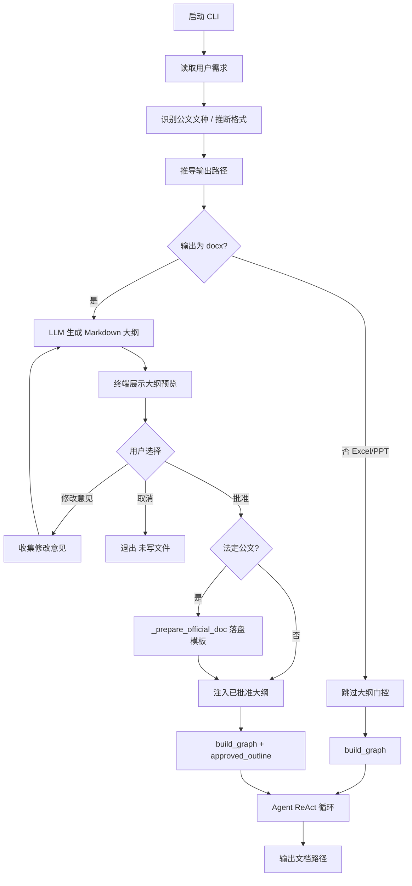
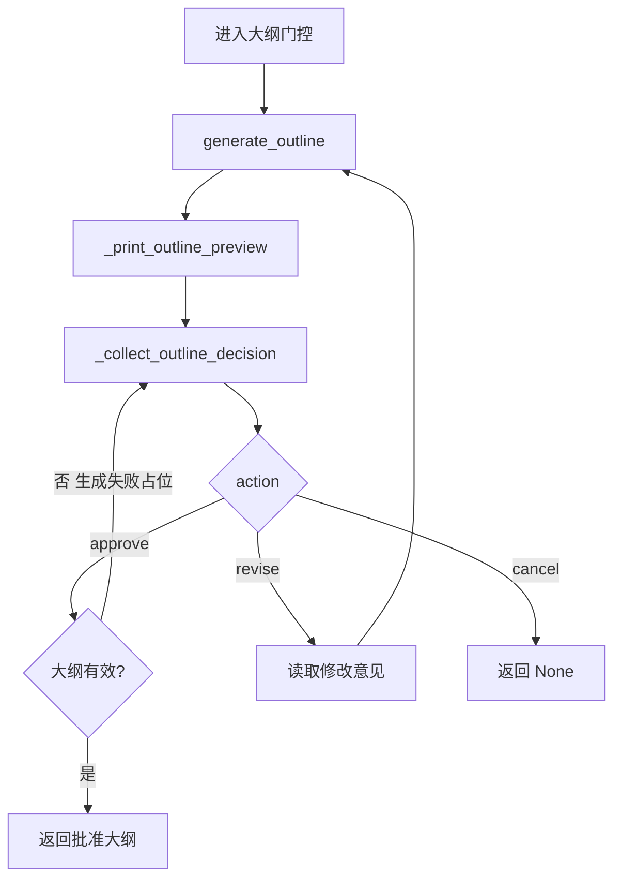
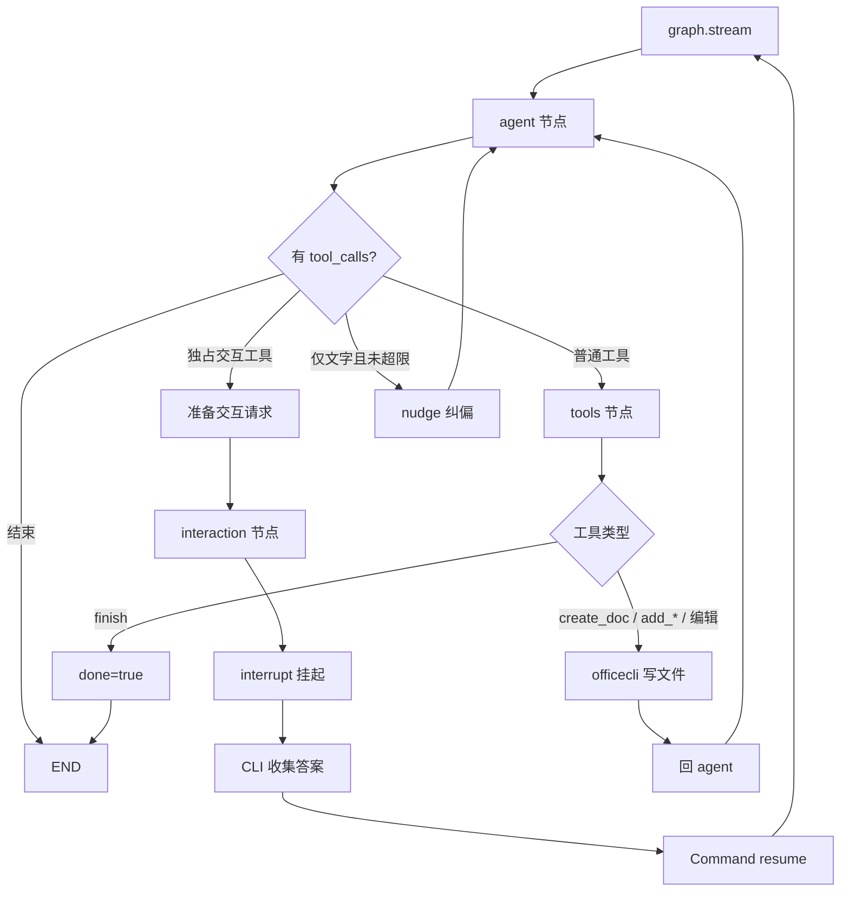
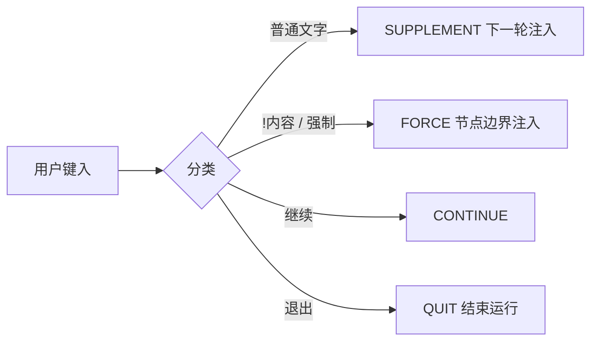

# Office Agent 流程图

Word（含法定公文）在写 `.docx` 前须经大纲预览批准；Excel / PowerPoint 跳过该门控。

## 总览：需求 → 大纲批准 → 生成

```mermaid
flowchart TD
  startNode[启动 CLI] --> req[读取用户需求]
  req --> detectType[识别公文文种 / 推断格式]
  detectType --> derivePath[推导输出路径]
  derivePath --> isWord{输出为 docx?}

  isWord -->|否 Excel/PPT| skipGate[跳过大纲门控]
  skipGate --> buildGraph[build_graph]
  buildGraph --> agentLoop[Agent ReAct 循环]
  agentLoop --> doneNode[输出文档路径]

  isWord -->|是| genOutline[LLM 生成 Markdown 大纲]
  genOutline --> showPreview[终端展示大纲预览]
  showPreview --> userAct{用户选择}

  userAct -->|修改意见| feedback[收集修改意见]
  feedback --> genOutline

  userAct -->|取消| exitCancel[退出 未写文件]

  userAct -->|批准| isOfficial{法定公文?}
  isOfficial -->|是| prepDoc["_prepare_official_doc 落盘模板"]
  isOfficial -->|否| injectOutline[注入已批准大纲]
  prepDoc --> injectOutline
  injectOutline --> buildGraphWord[build_graph + approved_outline]
  buildGraphWord --> agentLoop
```

## Word 大纲预览门控（细节）

```mermaid
flowchart TD
  enterGate[进入大纲门控] --> calling[generate_outline]
  calling --> printBox[_print_outline_preview]
  printBox --> decide[_collect_outline_decision]

  decide --> act{action}

  act -->|approve| checkValid{大纲有效?}
  checkValid -->|否 生成失败占位| decide
  checkValid -->|是| returnOutline[返回批准大纲]

  act -->|revise| readFb[读取修改意见]
  readFb --> calling

  act -->|cancel| returnNone[返回 None]
```

## Agent 写文档循环

```mermaid
flowchart TD
  streamStart[graph.stream] --> agentNode[agent 节点]
  agentNode --> routeAfter{有 tool_calls?}

  routeAfter -->|普通工具| toolsNode[tools 节点]
  routeAfter -->|独占交互工具| prepareInteraction[准备交互请求]
  routeAfter -->|仅文字且未超限| nudgeNode[nudge 纠偏]
  routeAfter -->|结束| endGraph[END]

  nudgeNode --> agentNode

  prepareInteraction --> interactionNode[interaction 节点]
  interactionNode --> interrupt[interrupt 挂起]
  interrupt --> collectUI[CLI 收集答案]
  collectUI --> resume[Command resume]
  resume --> streamStart

  toolsNode --> toolKind{工具类型}
  toolKind -->|create_doc / add_* / 编辑| writeFile[officecli 写文件]
  writeFile --> backAgent[回 agent]
  backAgent --> agentNode

  toolKind -->|finish| markDone[done=true]
  markDone --> endGraph
```

## 忙时输入（生成过程中）

```mermaid
flowchart LR
  busyInput[用户键入] --> classify{分类}
  classify -->|普通文字| soft[SUPPLEMENT 下一轮注入]
  classify -->|!内容 / 强制| force[FORCE 节点边界注入]
  classify -->|继续| cont[CONTINUE]
  classify -->|退出| quit[QUIT 结束运行]
```
