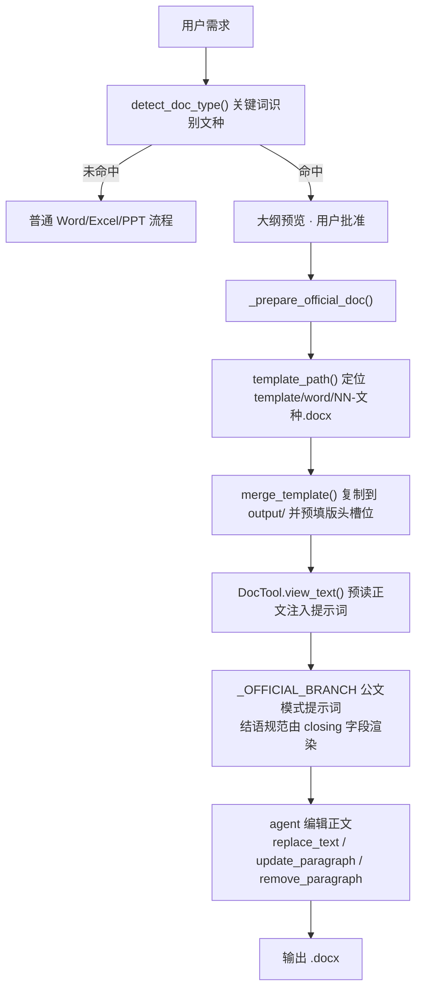

# 新增 Office 模板说明

本文说明**怎么给 office-agent 加一个新模板**。

目前业务上只做了 **Word 公文模板**（`template/word/`，GB/T 9704-2012 版式）；
Excel / PowerPoint 模板尚未实现，扩展要动的地方见文末[扩展到 Excel / PowerPoint](#扩展到-excel--powerpoint)。

新增一个 Word 模板只需两处改动：**写正文范例 spec** + **在注册表登记**。
文件名前缀、提示词里的文种清单与结语规范、`start_from_template` 的工具描述、
测试断言全部由注册表自动派生，不需要手改。

---

## 一、5 分钟加一个 Word 模板

以新增文种「公开信」为例。

### 第 1 步：在注册表登记 —— `src/office_agent/domain/templates.py`

在 `_DEFS` 列表**末尾追加**一条（不要插队，见[常见错误](#常见错误)）：

```python
    OfficialDocType(
        name="公开信",                      # 文种名，同时决定文件名 16-公开信.docx
        direction="downward",              # upward / downward / parallel / meeting
        summary="向社会公众公开说明情况、发出倡议",   # 给 LLM 看的适用情形
        keywords=("公开信", "致全体市民"),      # 命中任一即判定为该文种
        closing="特此公开。",                 # 结语用语，无固定结语就不写
    ),
```

`index` 不用写——由列表位置自动生成。

各字段的作用：

| 字段 | 作用 | 注意 |
|---|---|---|
| `name` | 文种名，同时是模板文件名后半段 | 与用户口语一致，别带书名号 |
| `direction` | 行向，决定版头/落款差异 | `upward` 上行文（版头出签发人）、`downward` 下行文、`parallel` 平行文、`meeting` 会议文种（无落款、无版记） |
| `summary` | 适用情形，进 `format_doc_type_list()` 给 LLM | 一句话 |
| `keywords` | `detect_doc_type()` 用的识别关键词 | 见[关键词怎么写](#二关键词怎么写) |
| `closing` | 结语用语，注入公文模式提示词 | 无固定结语留空，会自动归到"按其惯例"那一行 |
| `defaults` | 该文种特有的版头默认值 | 一般不用填 |

### 第 2 步：写正文范例 —— `scripts/gen_official_templates.py`

在 `DOCUMENTS` 列表末尾追加一条 `spec(...)`，`name` 必须与第 1 步一致：

```python
    spec(
        "公开信",
        "XX市XX机关致全市市民的公开信",          # 标题（范例文字）
        "全市广大市民朋友：",                    # 主送机关，会议文种传 ""
        [
            {"t": "p", "text": "为XX，现就XX事项向全市市民作如下说明。"},
            {"t": "h1", "text": "一、XX的基本情况"},
            {"t": "p", "text": "近年来，我市XX工作……"},
            {"t": "h2", "text": "（一）XX进展。"},
            {"t": "p", "text": "截至XX年X月，全市已完成XX。"},
            {"t": "closing", "text": "特此公开。"},
        ],
    ),
```

正文 item 的类型（对应 GB/T 9704 版式）：

| `t` | 用途 | 版式 |
|---|---|---|
| `p` | 正文段落 | 仿宋三号（16pt），首行缩进 2 字，固定行距 28pt |
| `h1` | 一级标题「一、」 | 黑体三号 |
| `h2` | 二级标题「（一）」 | 楷体三号 |
| `h3` | 三级标题「1.」 | 仿宋三号加粗 |
| `closing` | 结语（"特此通知。"等） | 同正文，独立成段 |
| `attach` | 附件说明「附件：1.XX表」 | 仿宋三号，左对齐不缩进 |
| `blank` | 空行 | —— |

`spec()` 的关键字参数（都有合理默认值，一般只需在特殊文种上覆盖）：

`org` 发文机关 / `doc_no` 发文字号 / `signer` 签发人（**只有上行文才传** `"{{signer}}"`）/
`signer_org` 落款署名 / `date_cn` 成文日期 / `cc` 抄送 / `issuer` 印发单位 / `issue_date` 印发日期。
会议文种（如纪要）把 `signer_org` / `date_cn` / `issuer` / `issue_date` 传 `""` 即可去掉落款和版记。

### 第 3 步：生成模板并自检

```bash
# 只生成新加的这一个（改版式时反复跑它，秒级）
uv run --no-project --with python-docx python scripts/gen_official_templates.py --only 公开信

# 自检：注册表 ↔ 正文 spec ↔ 模板文件三方一致（不写文件，无需 python-docx）
python scripts/gen_official_templates.py --check
```

自检失败会直接给出该怎么改，例如：

```
自检发现问题：
  ✗ 公开信: 注册表里有，但本脚本缺正文 spec（在 DOCUMENTS 末尾加一条 spec('公开信', ...)）
  ✗ 公开信: 模板文件缺失 16-公开信.docx（跑 gen_official_templates.py --only 公开信 生成）
```

### 第 4 步：跑测试

```bash
uv run pytest                                   # 单测，含注册表一致性
uv run pytest -m integration -k official_merge  # 可选：真调 officecli 验证 merge（需 officecli 二进制）
```

单测里的断言都由注册表派生，新增文种不需要改测试。

### 第 5 步：验收一次真实生成

```bash
uv run office-agent "写一封致全市市民的公开信，说明XX工作安排"
```

终端先打印 `✓ 识别为法定公文【公开信】`，大纲批准后再打印 `✓ 已从 GB/T 9704 模板创建`
（Word 一律先过大纲预览门控，批准前不落盘）。

---

## 二、关键词怎么写

`detect_doc_type()` 是**中文子串匹配**（不分词），命中任一关键词即判定为该文种，
所以关键词要**足够长、足够专**：

- 通用词必须加限定。`"决定"` 会命中"我决定要做"，所以注册表里用的是 `"作出决定"` `"的决定"`；
  `"报告"` 会命中"调研报告"，所以用的是 `"向上级报告"` `"工作报告"`。
- 多个文种同时命中时，按行向优先级裁决：**上行文 > 会议文种 > 平行文 > 下行文**
  （下行文的"通知/通报"最通用，让位）。同优先级取 `index` 小的。
- 「批复」有特判：文本里出现批复类关键词时直接判批复，不让"请示"抢判
  （"批复下级的请示"里的"请示"是宾语）。

单测 `test_every_type_detectable_by_own_keyword` 会验证每个文种至少有一个关键词能识别出自己；
新文种如果被别的文种抢判，这条会失败。

---

## 三、模板里的两类占位符

| 类型 | 形式 | 位置 | 谁来替换 |
|---|---|---|---|
| **版头固定槽位** | `{{org}}` `{{doc_no}}` `{{signer}}` `{{signer_org}}` `{{date_cn}}` `{{cc}}` `{{issuer}}` `{{issue_date}}` | 版头 / 落款 / 版记 | `officecli merge` 在创建文档时一次性预填 |
| **正文范例占位** | `XX`、`XX工作`、`X年X月X日` | 标题 / 主送 / 正文范例段 | agent 用 `replace_text` / `update_paragraph` 逐处替换 |

预填的值来自 `default_merge_data(doc_type, **overrides)`，优先级
**调用方 overrides > 文种 `defaults` > 全局默认值**。它保证返回的每个值都不是 `{{key}}` 字面量——
否则 merge 完的文档里会残留一串花括号。所以**正文范例里不要引入新的 `{{}}` 占位**，
除非同时在 `default_merge_data` 里给它一个默认值。

---

## 四、模板是怎么被用起来的



除了上面这条自动识别的路径，LLM 也能在会话中途主动调 `start_from_template(doc_type=...)`
切换文种（比如用户先说了模糊需求、后补充"要写成通知"），走的是同一套注册表和 merge 逻辑。

### 相关模块

| 模块 | 职责 |
|---|---|
| [src/office_agent/domain/templates.py](src/office_agent/domain/templates.py) | 文种注册表（唯一数据源）、文种识别、模板路径、merge 数据、`check_registry()` 自检 |
| [scripts/gen_official_templates.py](scripts/gen_official_templates.py) | 正文范例 spec + 渲染 .docx；`--only` / `--check` |
| [src/office_agent/cli/ui.py](src/office_agent/cli/ui.py) | `_prepare_official_doc()`：merge 模板 + 预读正文 |
| [src/office_agent/tools/common.py](src/office_agent/tools/common.py) | `start_from_template`：LLM 主动从模板创建文档 |
| [src/office_agent/tools/doc.py](src/office_agent/tools/doc.py) | `update_paragraph` / `replace_text` / `remove_paragraph`：编辑正文 |
| [src/office_agent/office/runner.py](src/office_agent/office/runner.py) | `merge_template()`：officecli merge 封装 |
| [src/office_agent/agent/prompts.py](src/office_agent/agent/prompts.py) | `_OFFICIAL_BRANCH`：公文模式提示词（结语清单由注册表渲染） |

---

## 五、自检清单

新增模板后逐条对一遍：

- [ ] `python scripts/gen_official_templates.py --check` 通过
- [ ] `uv run pytest` 通过
- [ ] 生成的 .docx 用 Word 打开：版头红字、红色分隔线、版记、页码都在
- [ ] 正文层级序号规范：一、→（一）→ 1. →（1），不跳级
- [ ] 上行文（`direction="upward"`）版头有"签发人："，其他文种没有
- [ ] `uv run office-agent "<含新文种关键词的需求>"` 能识别到新文种
- [ ] 在 [template/word/README.md](template/word/README.md) 的文种清单表里补一行

### 常见错误

| 现象 | 原因 | 处理 |
|---|---|---|
| 公文模式静默失效，走了普通生成流程 | 模板文件不存在（`_prepare_official_doc` 找不到模板就回退） | 跑 `--check`，按提示 `--only <文种>` 生成 |
| 老模板文件全变成"孤儿" | 在 `_DEFS` 中间插队新增，后续文种的 index 集体后移、文件名对不上 | 新文种一律追加到列表末尾；已经插队的话全量重新生成 |
| 生成的文档里残留 `{{xxx}}` | 正文里写了新的 `{{}}` 占位但 `default_merge_data` 没给默认值 | 要么去掉占位，要么在 `default_merge_data` 的 `base` 里补上 |
| 用户明明说了新文种却没被识别 | 关键词太短被别的文种抢判，或写了个不会出现的词 | 看 `test_every_type_detectable_by_own_keyword` 的失败信息，换更专的词 |
| 新文种的结语没进提示词 | 注册表条目漏了 `closing` | 补 `closing`，`format_closing_list()` 会自动带上 |

---

## 扩展到 Excel / PowerPoint

**当前未实现**——业务上只用到 Word 公文模板，代码里多处按 `.docx` 硬编码。
真要支持 xlsx / pptx 模板，需要动这些地方：

1. `domain/templates.py`：`TEMPLATE_DIR` 按文档类型分目录（`template/excel/`、`template/pptx/`），
   `OfficialDocType` 增加 `kind` 字段，`filename` 的扩展名跟着 `kind` 走。
2. `tools/common.py::start_from_template`：目前显式拦截 `kind != "docx"`（返回"公文模板只支持 Word"），
   要放开并按 kind 选对应的 Tool。
3. `cli/ui.py::_derive_doc_path`：识别到模板时强制 `.docx`，要改成按模板的 kind 决定扩展名。
4. `cli/ui.py::_prepare_official_doc`：预读正文写死用 `DocTool`，要按 kind 换 `ExcelTool` / `PptxTool`。
5. `agent/prompts.py`：`_OFFICIAL_BRANCH` 是 Word 段落语境（`/body/p[N]` 路径、`replace_text` 等），
   Excel / PPT 需要各自的模板编辑分支。
6. 生成脚本：`gen_official_templates.py` 依赖 `python-docx`，另两种格式要另写生成脚本
   （或直接把人工做好的 .xlsx / .pptx 提交进仓库，跳过脚本生成）。
7. `merge_template()`（`{{key}}` 预填）目前只在 .docx 上验证过，
   动手前先确认 officecli 的 `merge` 子命令对 xlsx / pptx 的支持情况。
